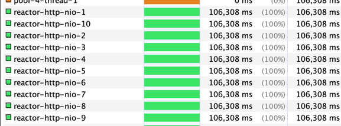
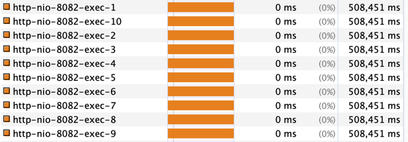
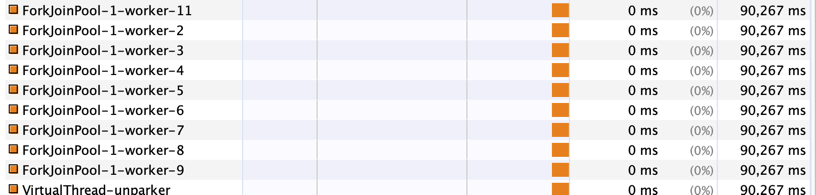

#

## Webflux

- worker thread count: 10

worker thread 를 blocking 하지 않는 이상 처리량에 문제가 발생하지 않는다.

reactor, coroutine 모두 잘 된다.

## Mvc

- thread count: 10

### async with coroutine and RestTemplate (Blocking IO)
코루틴 내의 blocking io 로 인해 스레드가 blocking 되어 dispatcher 에 정의된 스레드 수 만큼만 한번에 처리한다.

### async with coroutine and RestClient(reactor-netty factory)
RestClient 의 requestFactory 로 reactor-netty 를 사용해도 dispatcher 에 정의된 스레드 수 만큼만 한번에 처리한다.

RestClient 의 리턴 타입 자체가 publisher 가 아니라서 결국 내부에서 blocking 되어 스레드가 blocking 되는 것 같다. (어찌보면 당연..?)

RestClient 와 reactor-netty factory 를 함께 사용하는건 아무 의미가 없어 보인다.

### Just use Webclient
webclient.retrieve.block() 만 수행하지 않으면 blocking 없이 잘 수행된다.

block() 을 호출하면 이벤트 루프가 blocking 되어 처리량이 떨어진다.

즉, mvc 에서 webclient 를 사용해도 block() 을 이용하면 별로 의미가 없다.

### async with coroutine and virtual thread

withContext 에 virtualThreadExecutor 를 넣는 방식으로 테스트 했다. 이 떄 forkJoinPool 이라는 스레드 풀이 생기는데, 얘가 가상 스레드를 처리해주는 걸로 보인다.

별도 스레드 생성 없이 잘 수행되는걸로 보인다.

@Async 를 이용할 때도 가상 스레드를 이용하면 forkJoinPool 이 생기는데, 얘들로 잘 처리해준다. (forkJoinPool 10개로 200개의 요청을 동시에 처리한다)

## 정리
- Mvc 에서 RestTemplate, JPA, RestClient 등 기본적으로 blocking io 를 이용할 때
  - 코루틴은 사용할 필요가 없다. 어차피 blocking io 로 인해 코루틴이 block 되면 스레드도 block 되어 해당 스레드는 이용할 수 없게된다.
  - 가상 스레드를 적용할 수 있으면 잘 검토해서 적용하자. 확실히 별도 스레드 없이 빠르게 요청을 처리한다.
  - 그냥 별도 스레드 풀을 이용해서 @Async 를 사용해도 괜찮다.
- Mvc 에서 webclient 를 이용할 때
  - block() 을 호출하면 결국 워커 스레드(이벤트루프)를 block 하므로 의미 없다.
  - block() 호출 없이 코루틴 내에서 실행하는건 괜찮아보인다. 
- 가상 스레드, 코루틴, reactor 등 결국 별도 스레드를 이용하여 비동기처리한다. 다만 blocking io 를 이용할 때는 스레드 수가 그만큼 많아야 하고, non-blocking io 일 때는 적은 스레드로 가능한 것일 뿐이다.
  - 가상 스레드는 blocking io 에 상관없다. 가상 스레드가 block 된다고 플랫폼 스레드가 block 되는건 아니다. 좋은것같다...?

