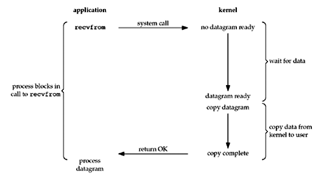
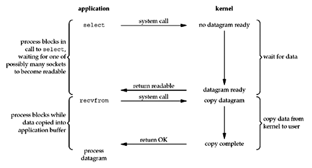

## 멀티플렉싱 (입출력다중화)
일반적으로 스레드가 하나의 요청에 대한 입출력밖에 처리하지 못하는 이유는 입출력 메서드가 블로킹되어 입출력 데이터가 준비될때까지 다른 요청을 처리할 수 없어집니다.

입출력다중화는 하나의 스레드에서 입출력을 모두 다룰 수 있는 기술을 의미하는데, 커널은 select, epoll 등의 시스템 콜을 통해 기능을 제공합니다.

### IO Blocking
스레드는 커널에게 IO 를 요청하고, CPU 는 점유하지 않은 채 커널이 결과를 반환할떄까지 대기합니다.
커널의 응답과 함께 반환되는 데이터는 버퍼로 들어오고, 이후 작업을 처리하게 됩니다.

### IO Multiplexing

멀티플렉싱 모델에서는 select 메서드를 통해 여러 소켓들 중 준비된 소켓이 생길때까지 대기하며, 결과가 반환되면 작업을 진행합니다.

블로킹 I/O 모델은 하나의 스레드에서 하나의 소켓에 대해 read 함수를 호출해 데이터가 커널 공간에 도착했는지 확인하고 현재 읽을 수 있는 데이터가 없는 경우 블록돼 대기했다면, 멀티플렉싱 I/O 모델은 여러 소켓을 동시에 확인하며 그중 하나 이상의 사용 가능한 소켓이 준비될 때까지 대기합니다.

## Java NIO
자바의 NIO 는 multiplexing 을 지원하는데, 이를 이용하면 스레드는 IO 가 끝날때 까지 기다리지 않고 다른 작업을 수행할 수 있습니다.

채널이 데이터를 읽어서 버퍼에 저장하는 동안 스레드는 다른 작업을 진행할 수 있고, 읽은 데이터가 버퍼에 모두 저장되면 스레드가 해당 데이터의 처리 작업을 재개할 수 있습니다.

### 채널
NIO 에서는 항상 채널과 버퍼를 이용해야하는데, 데이터를 주고받을때 채널을 이용하고 버퍼를 통해 데이터를 읽고 씁니다.

ServerSocketChannel 은 TCP connection 요청을 listen 하고, connection 을 accept 하게되면 SocketChannel 을 반환합니다.
SocketChannel 은 TCP 를 이용하여 네트워크에서 데이터를 읽거나 씁니다.

### 셀렉터
여러 채널에서 이벤트 발생 여부를 확인할 수 있는 객체로, 하나의 스레드에서 여러 채널을 관리할 수 있으므로 여러 소켓 연결을 관리할 수 있습니다.

위의 ServerSocketChannel 과 SocketChannel 을 셀렉터에 등록하고, select 메서드를 통해 이벤트 발생 여부를 확인할 수 있습니다.

## 이벤트 루프 (Reactor 패턴)

이벤트 루프는 이벤트를 처리하기 위한 무한 루프 스레드로, 특정 이벤트가 발생할 때까지 대기하다가 이벤트가 발생하면 이벤트 핸들러에게 디스패치해 처리하는 방식으로 작동합니다. 

단순히 설명하면 동시에 들어오는 여러 종류의 이벤트를 처리해주는 동시성을 제공하기 위한 프로그래밍 모델 중 하나입니다.  

### Reactor
이벤트 루프라고도 부르며, 이벤트가 발생할 때까지 무한으로 대기하다가 발생되면 이벤트를 처리할 수 있는 핸들러에게 디스패치합니다.

### Handler
이벤트를 받아서 로직을 수행합니다.

## Netty

### 참고
https://notes.shichao.io/unp/ch6/
https://blog.naver.com/n_cloudplatform/222189669084
https://engineering.linecorp.com/ko/blog/do-not-block-the-event-loop-part1